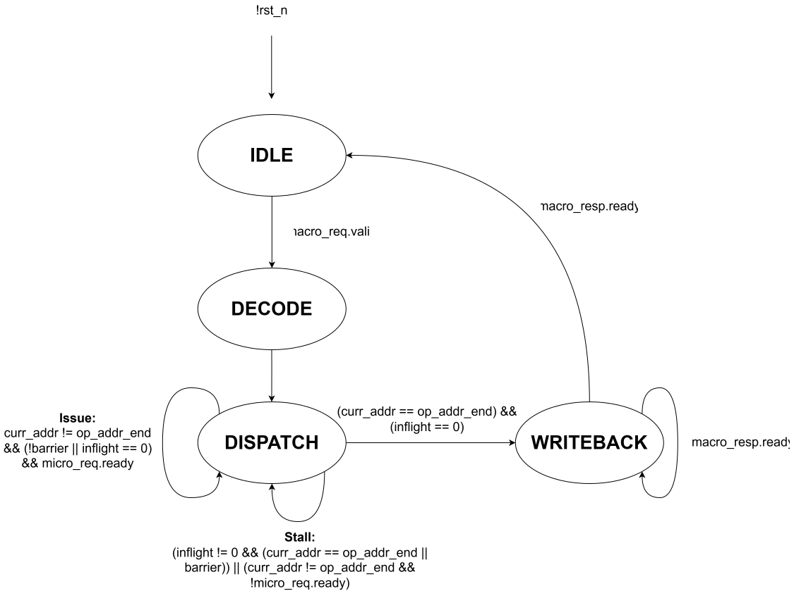

# `decode` — Decodes messages between the RTU and FUs

## Overview

This module sits inside the [Execution Unit](exu.md) and decomposes complex macro-ops from the RTU into simple micro-ops that the FUs can compute. The Decode Unit also composes micro-op results from the FUs into macro-op results to send back to the RTU.

## Parameters

| Name          |   Default    | Description                           |
|---------------|:------------:|---------------------------------------|
| `WLEN`  |     16      | Word length              |
| `MICRO_W`  |     13    | Micro operation width             |
| `MACRO_W`  |     101    | Macro operation width             |
| `MACROOP_W`  |     5      | Macro opcode width |
| `MICROOP_W`  |     4      | Micro opcode width |

## Ports

### Inputs

| Name          |   Width    | Description                           |
|---------------|:------------:|---------------------------------------|
| `clk`  |     1      | Clock signal |
| `rst_n`  |     1      | Active-low reset |
| `rf_result`  |     `vec3_t`      | Register file R0-R2, sent to the RTU as the macro-op result |

### Outputs

| Name          |   Width    | Description                           |
|---------------|:------------:|---------------------------------------|
| `rf_load`  |     1      | Loads the macro-op operands into the register file; high in the cycle a macro-op is accepted |

### Interfaces

| Type          | Description                           |
|---------------|---------------------------------------|
| [`macro_if.server`](../tinytracer_if.md#macro_if)  | Macro-op request and response channel from the RTU, passed through by the EXU |
| [`micro_if.client`](../tinytracer_if.md#micro_if)  | Micro-op request and response channel to FU Control |

## Architecture Overview

This overview will refer to the encodings for macro and micro instructions defined in [Instruction Encoding](../../encoding/instruction.md). The Decode Unit behaves according to the following finite-state machine (FSM):

### FSM States
- `IDLE`: Waiting for valid macro-op; loads the register file when one is accepted
- `DECODE`: Decoding macro-op fields
- `DISPATCH`: Issuing micro-ops based on macro-op
- `WRITEBACK`: Waiting for RTU to accept macro-op result

When a valid macro-op is accepted (`macro.req_valid` and `macro.req_ready` both high), the Decode Unit asserts `rf_load` for that cycle, which loads all of the macro-op operands into the register file in parallel: $u_1$, $u_2$, $u_3$ into R0-R2 and $v_1$, $v_2$, $v_3$ into R3-R5. The layout is the same for every macro-op, and the micro-op sequences in [Instruction Encoding](../../encoding/instruction.md) are written against it. The FSM then transitions to the `DECODE` state, where only the `MACROOP` field is recorded in the `macro_op` register; the operands live in the register file, so they are not stored a second time. `DECODE` then transitions to `DISPATCH`.

In `DISPATCH`, the Decode Unit uses the `MACROOP` field to select the sequence of micro-ops that execute the desired macro-op. For scalar operations, the selected micro-op is the same as the macro-op, setting `MICROOP` to `MACROOP[3:0]`. For vector operations, the macro to micro-op decompositions defined in [Instruction Encoding](../../encoding/instruction.md) are stored in a small read-only-memory (ROM), where each row holds a `MICRO_W`-bit micro-op and a `barrier` bit for pipeline hazards. The Decode Unit uses the `MACROOP` field to select an address `op_addr` to begin reading micro-ops from, along with an address `op_addr_end` to read up to (exclusive). `op_addr_end` - `op_addr` equals the number of micro-ops required to execute a macro-op. Note that scalar macro-ops also have an entry in the ROM (R0 $\leftarrow$ R0, R3, i.e. $u_1$ op $v_1$) to enable the same FSM transition logic to be used for both scalar and vector macro-ops. The following table shows how `MACROOP` is mapped to ROM addresses:

| `MACROOP`  |   `op_addr` | `op_addr_end` 
|:----:|:-------:|:-------:|
| `M_VADD`  | 0 | 3 |
| `M_VSUB`  | 3 |  6 |
| `M_SCAL_VEC`  | 6 | 9 |
| `M_DOT`  | 9 | 14 |
| `M_CROSS`  | 14 | 23 |
| `M_NORM`  | 23 | 29 |
| `M_SPHERE_NORM`  | 29 | 32 |
| Scalar  | 32 | 33 |

 For example, a vector add macro-op (`M_VADD`) would read micro-ops beginning from address 0 up to address 3, which corresponds to the following micro-ops:

 1. ADD R0 $\leftarrow$ R0, R3
 2. ADD R1 $\leftarrow$ R1, R4
 3. ADD R2 $\leftarrow$ R2, R5. 
 
 The bits stored in rows 0-2 of the ROM would be `14'b00000000110000`, `14'b00010011000000`, and `14'b00100101010000`. Once `op_addr` is determined and a micro-op from ROM is read, `curr_addr` is set to `op_addr` and a micro-op request is sent to the `fu_control` module. The Decode Unit allows for pipelined execution of micro-ops, keeping track of in-flight micro-ops with a 4 bit `inflight` counter that increments for every issued micro-op and decrements each time the `done` signal is asserted back from the `fu_control` module. `inflight` is unchanged if a micro-op issues at the same time another micro-op completes. 
 
 To prevent read-after-write (RAW) and write-after-write (WAW) hazards, certain micro-ops in the ROM have their `barrier` bit set to indicate that all prior micro-ops must complete before the current micro-op can execute. This is similar to a fence instruction which enforces load/store instruction order in multiprocessors, but for arithmetic instructions instead. ROM entries 12, 13, 20, and 24-26 have their `barrier` bits set. For example, the first and second ADD instructions (entries 12 and 13) in a vector dot-product operation (`M_DOT`) have their `barrier` bits marked, since the first ADD depends on the previous three MULs and the second ADD depends on the first ADD. 
 
 There are two possible actions the Decode Unit can take while in the `DISPATCH` state. The first possible action is issuing micro-ops, which occur when there are remaining micro-ops to execute (`curr_addr` != `op_addr_end`), a micro-op's `barrier` bit is clear or the pipeline is empty, and the `fu_control` module can accept a micro-op request. Issuing micro-ops results in `curr_addr` being incremented.
 
 The second possible action is stalling, which occurs when the pipeline is nonempty and there are either no remaining micro-ops to execute or a micro-op's `barrier` bit is set. Stalling also occurs when the `fu_control` module is unable to accept a micro-op request. 

 Once a macro-op is complete (`curr_addr` == `op_addr_end` and `inflight` == 0), the FSM transitions to the `WRITEBACK` state. The macro-op result needs no separate read step: the register file drives R0-R2 onto `rf_result`, which the Decode Unit passes straight to `macro.resp_result`. Scalar results are in R0 (`resp_result.x`).
 
 During the `WRITEBACK` state, the FSM checks if the RTU can accept a macro-op result (in general it should always be able to). If the RTU is ready, the Decode Unit sends the macro-op result over the macro-op response channel and transitions back to the `IDLE` state.

### Timing Behaviour

It takes 2 cycles to transition from `IDLE` to `DECODE` to `DISPATCH`; the register file is loaded on the first of these. Next, the time spent in the `DISPATCH` state ranges from 3-77 cycles (for `M_ADD` and `M_NORM` operations, assuming 16 cycle latency for the multiplier and CORDIC). Finally, `WRITEBACK` takes 1 cycle. Hence, the latency of executing a macro-op ranges from 6-80 cycles.